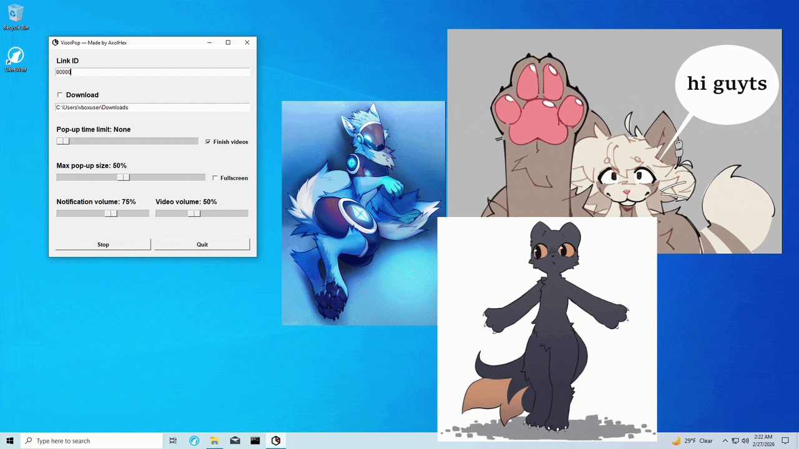
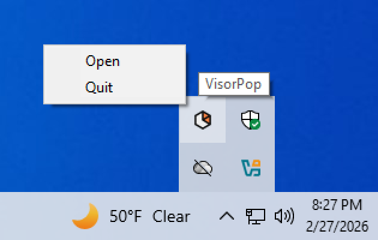

# VisorPop

<https://github.com/axolhex/VisorPopWalltaker>

## About

VisorPop is a Walltaker client that creates a pop-up window whenever a new post is set in your Walltaker link. Pop-ups are customizable and multiple pop-ups can be open at the same time. 
Images, gifs and videos are all supported!

This application connects to the 18+ website walltaker.joi.how and should **only** be used by adults.

## Installation

### Windows

Download and extract VisorPopWindows.v1.0.0.zip from the [releases page](https://github.com/axolhex/VisorPopWalltaker/releases).

If you encounter the error "Failed to load Python DLL", you will also need to download and install the Microsoft Visual C++ Redistributable: 
<https://learn.microsoft.com/en-us/cpp/windows/latest-supported-vc-redist?view=msvc-180#latest-supported-redistributable-version>

Currently, only 64-bit Windows systems are supported.

### Linux

Install dependencies with one of the following commands.

- Ubuntu: 
`sudo apt install python3 python3-pip python3-dev python3-venv python3-tk libmpv2 libayatana-appindicator3-1 libgirepository-2.0-dev gcc libcairo2-dev pkg-config gir1.2-gtk-4.0`
- Fedora: 
`sudo dnf install python3 python3-pip python3-devel python3-tkinter mpv-libs libappindicator-gtk3 gcc gobject-introspection-devel cairo-gobject-devel pkg-config gtk4`
- Arch: 
`sudo pacman -S python python-pip tk mpv libappindicator cairo pkgconf gobject-introspection gtk4`
- openSUSE: 
`sudo zypper in python3 python3-pip python3-devel python3-tk libmpv2 libappindicator3-1 cairo-devel pkg-config gcc gobject-introspection-devel`

If you are using GNOME, you will also need gnome-shell-extension-appindicator if it's not already installed.

- Ubuntu: 
`sudo apt install gnome-shell-extension-appindicator` 
`gnome-extensions enable appindicatorsupport@rgcjonas.gmail.com`
- Fedora: 
`sudo dnf install gnome-shell-extension-appindicator` 
`gnome-extensions enable appindicatorsupport@rgcjonas.gmail.com`
- Arch: 
`sudo pacman -S gnome-shell-extension-appindicator` 
`gnome-extensions enable appindicatorsupport@rgcjonas.gmail.com`
- openSUSE: 
`sudo zypper in gnome-shell-extension-appindicator` 
`gnome-extensions enable appindicatorsupport@rgcjonas.gmail.com`

Download and extract VisorPopLinux.v1.0.0.zip from the [releases page](https://github.com/axolhex/VisorPopWalltaker/releases).

Make the VisorPop script executable with: `chmod +x VisorPop.sh`

Start the script with: `./VisorPop.sh`

## Usage

### Starting VisorPop

Enter your link ID, adjust the setting to your liking and press Start! 
Upon starting, VisorPop's menu will be hidden and the application will run in the background. You can reopen the menu and quit the application with the system tray icon.

Shortly after starting, a pop-up window of the current post set in your Walltaker link should appear to confirm the client is working.

### Pop-up Controls

- Double left click to close a pop-up window.
- Right click to disable a pop-up's time limit.
- Use the scroll wheel to change the volume of a video.

## Known Issues

- When using multiple monitors, fullscreen pop-ups cover all screens instead of just one.
- When using multiple monitors, pop-up windows are sometimes larger than expected.
- On some Linux distributions, mpv's gpu context can not be set to x11 in order to properly embed the player. The video output is set to x11 as a fallback, but this significantly reduces performance.

## License

VisorPop is free open source software licensed under the GNU General Public License version 3. View full license terms in the [COPYING file](COPYING) or at <https://www.gnu.org/licenses/gpl-3.0.html>. 
The Windows release of this software redistributes third-party libraries, the licenses and attributions of which can be found in the [licenses directory](licenses/).

This is an indepedent project and is not officially affiliated with Walltaker or any other third-party.
